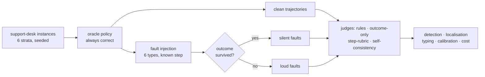

<div align="center">

# trajectory-judge

[](https://github.com/mohammadi-hadi/trajectory-judge/actions/workflows/ci.yml)
[](https://pypi.org/project/trajectory-judge/)
[](https://doi.org/10.5281/zenodo.21797926)
[](https://www.python.org/downloads/)
[](LICENSE)

*How much does an LLM judge miss when an agent reaches the right answer the wrong way?*

</div>

Outcome-only evaluation is the production default for agents: show a judge the request and the
reply, ask whether it was handled well. It cannot see a trajectory that skipped a required
check, acted against what a tool returned, or promised something no observation supports — as
long as the final answer came out right. Those are the failures that survive into production,
because the metric meant to catch them is structurally blind to them.

This repository measures that blind spot where the ground truth is known by construction: a
deterministic tool-using environment, a scripted policy that always solves it correctly, and a
fault injector that breaks exactly one thing at a known step and records whether the
customer-visible outcome survived. Five judges are then asked the same questions about each
trajectory — is it faulty, of which kind, at which step if they can see steps at all, and how
sure are you — and scored on detection, localisation, typing, calibration and cost.



## What it demonstrates

- **Ground truth without annotation.** A scripted oracle plus injected faults gives every
  trajectory a label — faulty or not, which step, which type, and whether the outcome survived —
  at no annotation cost. Fault injection for failure attribution is established practice
  (see [References](#references)); what is done with it here is the controlled comparison.
- **The stratification that matters.** Faults are split by whether the customer-visible outcome
  stayed correct. Reporting one recall number over both strata hides exactly the effect worth
  measuring.
- **An honest free baseline.** A rule engine encodes the process the agent was supposed to
  follow. Its coverage is uneven *by construction* and the gaps are pinned by tests — which is
  the argument for LLM judges, stated as a measurement instead of an assertion.
- **Evaluation as engineering.** Constrained JSON decoding, explicit context sizing, seeded and
  reproducible runs, resumable long jobs, cost and latency reported next to accuracy, and a CI
  check that the committed tables are exactly what the committed raw verdicts produce.
- **Calibration, not just accuracy.** Every judge must state a confidence, and every judge is
  scored on whether that confidence meant anything.

## Quickstart

```bash
pip install trajectory-judge
```

Or without installing anything, since the mock judge needs no model:

```bash
docker run --rm ghcr.io/mohammadi-hadi/trajectory-judge
```

Working from a clone instead:

```bash
pip install -e ".[dev]"
make test          # full suite: no model, no network, a fraction of a second
make demo          # end-to-end on the deterministic mock judge, under a minute
```

The real run needs [Ollama](https://ollama.com) and nothing else — no API keys anywhere:

```bash
ollama pull qwen2.5:14b
make run MODEL=qwen2.5:14b N=400     # appends to results/raw, resumable
make report                          # rebuilds every table and figure, offline
```

`make run` is resumable: verdicts are appended keyed by `(trajectory, judge)`, and a rerun skips
what is already on disk. `make report` never calls a model — it rebuilds the tables and figures
from the raw verdicts committed in this repository, so every number below can be reproduced
without running anything.

## The environment

A support desk with seven tools (`get_customer`, `lookup_order`, `get_policy`,
`check_eligibility`, `issue_refund`, `escalate`, `reply`) and a procedure the agent must follow:
verify the customer, look up the order, read the policy for the item, confirm eligibility before
moving money, refund exactly what was authorised, escalate when not eligible, and reply saying
only what the observations support. Six instance strata cover full-price refunds, restocking
fees, expired windows, non-refundable items, orders belonging to someone else, and orders
already refunded.

**The environment is permissive and the checker is strict.** `issue_refund` will refund an order
whose eligibility was never checked, exactly as a real payments API would. Nothing in the world
stops an agent from skipping the process — only the rules say it was wrong. Without that split
there would be no silent failures to measure, which is why it is a test
(`test_environment_is_permissive_by_design`).

## The six failure types, and what a rule engine can see

Each mutation edits the oracle's call list at a known step and replays it, so a faulty
trajectory is as internally consistent as a real run. Coverage of the rule engine below is
measured, not estimated, and pinned by `test_checker_coverage_is_what_the_readme_claims`.

| Failure type | What it is | Rules catch it | Outcome survives |
|---|---|---:|---|
| `skipped_precondition` | refunds without confirming eligibility | 100% | at full price, yes |
| `hallucinated_argument` | looks up a policy for an SKU nobody mentioned | 100% | yes |
| `ignored_observation` | refunds an amount other than the one authorised | 100% | no |
| `premature_stop` | stops before acting or replying | 100% | no |
| `wrong_tool` | re-fetches the order instead of reading the policy | **0%** | yes |
| `unsupported_claim` | promises a replacement nobody dispatched | **0%** | yes |

The two zeroes are the point. A plausible-but-wrong tool choice breaks no rule, and an invented
sentence in the reply is not a rule violation at all — both need something that reads.

## Results

400 trajectories: 100 clean, 175 silent faults, 125 loud faults. Judges run locally on Ollama,
single-pass at temperature 0 unless stated. Raw verdicts are committed, so `make report`
reproduces every number here with no model and no network.

| Judge | F1 | Silent recall | Loud recall | False alarms | Step exact | Type F1 | ECE | s/traj |
|---|---:|---:|---:|---:|---:|---:|---:|---:|
| `programmatic` | 0.800 | 0.429 | 1.000 | 0.000 | 1.000 | 0.667 | 0.075 | 0.0 |
| `outcome:qwen2.5:14b` | 0.712 | 0.451 | 0.840 | 0.330 | n/a | 0.300 | 0.253 | 3.5 |
| `step:qwen2.5:14b` | 0.923 | 0.766 | 0.984 | 0.000 | 0.973 | 0.606 | 0.033 | 10.4 |
| `step:llama3.1:8b` | 0.852 | 0.983 | 1.000 | 1.000 | 0.807 | 0.311 | 0.148 | 1.5 |
| `selfcons3:qwen2.5:14b` | 0.913 | 0.760 | 0.960 | 0.010 | 0.982 | 0.583 | 0.084 | 30.2 |

Strata each judge actually saw:

| Judge | clean | silent faults | loud faults |
|---|---:|---:|---:|
| `programmatic` | 100 | 175 | 125 |
| `outcome:qwen2.5:14b` | 100 | 175 | 125 |
| `step:qwen2.5:14b` | 100 | 175 | 125 |
| `step:llama3.1:8b` | 100 | 175 | 125 |
| `selfcons3:qwen2.5:14b` | 100 | 175 | 125 |

A *silent* fault left the customer-visible outcome correct; a *loud* one did not.

`n/a` under step localisation means the judge has no step field to fill: the outcome-only judge never sees the steps, so it is not asked to name one.

**The `programmatic` row's ECE is not a measurement.** The rule engine has no opinion about its own reliability, so its confidence is two hand-set constants (0.95 when a rule fires, 0.60 when none does). Its ECE scores those constants; every other row scores what a model actually said about itself.

| Failure type | `programmatic` | `outcome:qwen2.5:14b` | `step:qwen2.5:14b` | `step:llama3.1:8b` | `selfcons3:qwen2.5:14b` |
|---|---|---|---|---|---|
| wrong_tool | 0.00 | 0.34 | 1.00 | 1.00 | 1.00 |
| hallucinated_argument | 1.00 | 0.34 | 1.00 | 0.94 | 1.00 |
| skipped_precondition | 1.00 | 0.74 | 1.00 | 1.00 | 1.00 |
| ignored_observation | 1.00 | 0.76 | 1.00 | 1.00 | 1.00 |
| premature_stop | 1.00 | 1.00 | 0.96 | 1.00 | 0.90 |
| unsupported_claim | 0.00 | 0.50 | 0.18 | 1.00 | 0.16 |
| *(false alarms on clean)* | 0.00 | 0.33 | 0.00 | 1.00 | 0.01 |

Recall on each injected failure type. Read each column against its last row: recall at or near a judge's false-alarm rate is not detection, it is the judge's baseline willingness to say *faulty*.


Read the red × against the bars: a judge that flags everything scores perfect recall and is
worth nothing.


Points below the diagonal are overconfidence. The outcome-only judge sits well below it across
its whole range — it is most certain in exactly the region where it is least right.

### What this says

**The blind spot is real and it is about half the faults.** `outcome:qwen2.5:14b` catches 84% of
faults that broke the answer and 45% of faults that did not. The judge is not weak — it is
looking at evidence that does not contain the failure. It also flags a third of correct
trajectories, so it is noisy *and* blind, which is the worst pair to have in a metric people
trust enough to gate releases on.

**Showing the judge the trajectory costs three times as much and pays for itself.**
`step:qwen2.5:14b` reaches
0.766 silent recall, 0.973 exact step localisation, and **zero false alarms across 100 clean
trajectories** — of the 257 trajectories it flagged, every one was genuinely faulty. Its stated
confidence is also nearly honest (ECE 0.033 against the outcome judge's 0.253).

**Nobody reads the final answer.** `unsupported_claim` — the agent follows the procedure
perfectly and then invents a promise in the reply — is caught by the rule engine 0% of the time
and by the step-rubric judge 18%. The outcome-only judge's 0.50 looks better until you read it
against its 0.33 false-alarm rate: it is barely above the rate at which it flags correct work.
A missed example is diagnostic — the step judge walks the procedure, concludes *"the agent's
trajectory follows the procedure correctly, step by step: 1. verified customer identity…"*, and
never checks the sentence it was asked to check, at confidence 0.92. Giving a judge the whole
trajectory makes it better at everything except the failure that lives in the answer, where it
gets worse, because its attention goes to the steps.

**Read every recall against its false-alarm rate.** `wrong_tool` at 0.34 for the outcome judge
is not detection at all — that judge flags 0.33 of clean trajectories. Same number, no signal.

**`step:llama3.1:8b` is the always-say-faulty baseline wearing a judge's clothes.** It flags
397 of 400 trajectories, so its recall is 1.00 nearly everywhere and its F1 of 0.852 is just the
base rate of faults in the set (precision 0.748 ≈ 300/400). Its rationales average 56 output
tokens against the 14B model's 391 — it emits a placeholder sentence and jumps to the verdict.
Same prompt, same schema, same grammar: this is a capability floor, not a prompting artefact.
It is in the table because a cheap local judge that looks excellent on recall alone is a
mistake worth being able to point at.

**The rule engine is the best value in the table and still not enough.** Free, instant, perfect
localisation, zero false alarms, and it types faults better than the LLM judge does
(macro-F1 0.667 vs 0.606) because it never guesses. It also misses 57% of silent faults, and
there is no version of it that does better — two of the six types are outside what rules can
express.

**Self-consistency cost 3× and bought nothing.** `selfcons3` is the same step-rubric judge
sampled three times at temperature 0.7 with a majority vote. It is marginally *worse* than one
greedy pass on detection (0.913 vs 0.923), silent recall (0.760 vs 0.766), type attribution
(0.583 vs 0.606) and calibration (ECE 0.084 vs 0.033), better only on step localisation
(0.982 vs 0.973), and it takes 30.2 s per trajectory against 10.4. The calibration result is the
instructive one: vote share was supposed to be a real estimate where a single judge's stated
confidence is not, but with k=3 it can only express two values and neither sits near the
observed accuracy. Voting sharpened nothing here because the errors are not sampling noise —
`unsupported_claim` goes 0.18 → 0.16, so all three samples miss the same invented promises.
That is worth knowing before anyone pays 3× for an ensemble on this kind of task.

**Detecting a fault and naming it are different problems.** The step judge's confusion matrix
(`results/tables/confusion.md`) shows near-perfect detection with attribution that slips a third
of the time. It finds all 50 `hallucinated_argument` cases and calls 35 of them `wrong_tool` —
fetching a policy for an invented SKU does look like a bad tool choice, and part of that is the
taxonomy's boundary rather than the judge's mistake. `premature_stop` scatters worse: of 50, it
names 14 correctly, calls 17 `unsupported_claim` and 11 `skipped_precondition`, which is a
reasonable reading of a trajectory that stopped early and then said something it had not
established. If a verdict is going to route a ticket or fill a dashboard category, this gap
matters more than the detection number above it.

### What a model actually does here

60 episodes with `qwen2.5:14b` driving the agent, labelled by the rule engine rather than an
oracle and therefore reported separately and never mixed into the comparison above.

Episodes played: **60**

| Observation | Count | Share |
|---|---:|---:|
| flagged by the rule checker or wrong outcome | 13 | 0.22 |
| wrong customer-visible outcome | 10 | 0.17 |
| faulty but outcome still correct | 3 | 0.05 |

| Rule-visible failure type | Count |
|---|---:|
| premature_stop | 13 |

Labels here come from the rule checker, which is blind to `wrong_tool` and `unsupported_claim`, so the true fault rate is at least this high.

Worth stating plainly: the organic failures are almost all `premature_stop`, while the injected
distribution spans all six types evenly. The benchmark therefore measures *what a judge is
capable of catching*, not how often each fault occurs in the wild. Those are different
questions and only the first one is answered here.

## Design notes

- **Why an oracle instead of collecting agent runs?** Labelling real runs needs a labeller, and
  the labeller is the thing under test. A scripted policy gives trajectories that are correct by
  construction, so a flag on a clean one is a false positive with nothing to argue about.
- **Why stratify by outcome rather than report one recall?** Because a single number averages
  the blind spot away. The gap between 0.84 and 0.45 for the outcome judge is the entire result;
  pooled, it would read as a respectable 0.68.
- **Why does the judge get the procedure in its prompt?** A judge that has not been told the
  rules is guessing at policy. Both judges get the same standard operating procedure, word for
  word, so the only difference between them is how much of the trajectory they see. One
  consequence worth naming: the agent in *What a model actually does here* was given that same
  text, so it and its judge were working from identical wording.
- **Why `reasoning` first in every response schema?** Property order in a JSON schema is
  generation order under constrained decoding, so putting the reasoning field first is
  chain-of-thought enforced by the grammar rather than requested politely.
- **Why set `num_ctx` explicitly?** Ollama's default context silently truncates a rendered
  trajectory. A judge scoring the half it happened to see is a bug that reads as a finding.
- **Why is type scoring restricted to genuinely faulty trajectories?** A judge that flags a
  clean trajectory and names a type is already charged by detection precision. Counting it again
  in the confusion matrix would bill the same mistake twice.
- **Why commit the raw verdicts?** So the tables are checkable. CI regenerates them from the
  committed JSONL and fails on any drift, which means the numbers above cannot quietly stop
  matching the data they came from.

## Limitations

- **One environment, one domain.** A support desk with encoded preconditions is a friendly case
  for step-level judging. Open-ended coding or browsing agents have no comparable rule engine.
- **Injected faults are cleaner than real ones.** Each mutation breaks exactly one thing at one
  step. Real trajectories fail in cascades, and the organic episodes above show the fault mix in
  the wild is nothing like uniform.
- **Local models only.** Everything runs on `qwen2.5:14b` and `llama3.1:8b` so the results are
  reproducible without an API key. A frontier judge would very likely close part of the
  `unsupported_claim` gap; this repository does not claim otherwise, it just does not measure it.
- **Confidence is self-reported.** Single-pass judges state a number; only the ensemble's
  confidence is an estimate of anything, and that is visible in the ECE column.
- **Two of the six types share a blurry border.** A policy fetched for an invented SKU is
  simultaneously an ungrounded argument and a tool that does not serve the sub-goal. The
  confusion matrix charges the judge for choosing the other reading, which overstates its
  attribution error somewhat. Detection numbers are unaffected.
- **`silent` is defined by the outcome the environment can see.** A refund of the right amount
  by the wrong route counts as outcome-correct here. A bank auditing the route would disagree,
  which is the point of measuring the route separately.

## References

- Zhang et al. — *AgenTracer: Failure Attribution in LLM Systems* ([arXiv:2509.03312](https://arxiv.org/abs/2509.03312)). Programmatic fault injection into successful trajectories to build annotated trajectory–error pairs.
- *Beyond the Final Answer: Evaluating the Reasoning Trajectories of Tool-Augmented Agents* ([arXiv:2510.02837](https://arxiv.org/abs/2510.02837)).
- *TRAJECT-Bench: A Trajectory-Aware Benchmark for Evaluating Agentic Tool Use* ([arXiv:2510.04550](https://arxiv.org/abs/2510.04550)).
- Guo et al. — *Automatic Failure Attribution and Critical Step Prediction for Multi-Agent Systems* ([arXiv:2509.08682](https://arxiv.org/abs/2509.08682)).
- Mohammadi et al. — *EvalMORAAL: Interpretable Chain-of-Thought and LLM-as-Judge Evaluation for Moral Alignment in LLMs*, \*SEM 2026 ([paper](https://aclanthology.org/2026.starsem-conference.34/)). The judge design here — reasoning before verdict, interpretable rationale, stated confidence — comes from this work.
- Mohammadi et al. — *Assessing the Reliability of LLM Annotations in the Context of Demographic Bias and Model Explanation*, GeBNLP @ ACL 2025 ([doi](https://doi.org/10.18653/v1/2025.gebnlp-1.9)). On treating a model's labels as measurements that need their own reliability estimate.

## Citation

If this benchmark is useful in your research, please cite it (see
[CITATION.cff](CITATION.cff)):

```bibtex
@software{mohammadi_trajectory_judge,
  author  = {Mohammadi, Hadi},
  title   = {trajectory-judge: measuring what LLM judges miss when an agent reaches the right answer the wrong way},
  url     = {https://github.com/mohammadi-hadi/trajectory-judge},
  doi     = {10.5281/zenodo.21797926},
  version = {0.1.0},
  year    = {2026}
}
```

## License

MIT — see [LICENSE](LICENSE).
