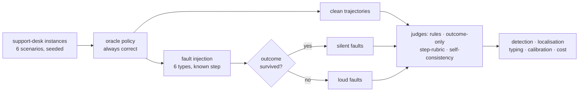

<div align="center">

# trajectory-judge

[](https://github.com/mohammadi-hadi/trajectory-judge/actions/workflows/ci.yml)
[](https://pypi.org/project/trajectory-judge/)
[](https://doi.org/10.5281/zenodo.21797926)
[](https://www.python.org/downloads/)
[](LICENSE)

*How much does an LLM judge miss when an agent reaches the right answer the wrong way?*

</div>

Paper: *trajectory-judge: What Outcome-Only LLM Judges Miss on Agent Trajectories*, NeurIPS 2026
workshop "Who Verifies the Agents? Toward Reliable Agent Development"
([arXiv:2609.00038](https://arxiv.org/abs/2609.00038)). To rebuild its numbers, see
[Reproducing the paper](#reproducing-the-paper).

Outcome-only evaluation is the production default for agents: show a judge the request and the
reply, and ask whether it was handled well. As long as the final answer came out right, that
judge cannot see a trajectory that skipped a required check, acted against what a tool returned,
or promised something no observation supports. Those failures survive into production because
the metric meant to catch them never looks at the steps.

This repository measures that blind spot where the ground truth is known in advance: a
deterministic tool-using environment, a scripted policy that always solves it correctly, and a
fault injector that breaks a single thing at a known step and records whether the
environment outcome (the refund or escalation) survived and whether the reply changed. Every
fault keeps a link to the clean run it was made from. Five judges then answer the same questions about each
trajectory (is it faulty, of which kind, at which step if they can see steps at all, and how
sure are they) and are scored on detection, localisation, typing, calibration and cost.


```mermaid
flowchart LR
    A["support-desk instances<br/>6 scenarios, seeded"] --> B["oracle policy<br/>always correct"]
    B --> C["fault injection<br/>6 types, known step"]
    B --> D["clean trajectories"]
    C --> E{"outcome<br/>survived?"}
    E -->|yes| F["silent faults"]
    E -->|no| G["loud faults"]
    D --> H["judges: rules · outcome-only<br/>step-rubric · self-consistency"]
    F --> H
    G --> H
    H --> I["detection · localisation<br/>typing · calibration · cost"]
```

## What it demonstrates

- **Ground truth without annotation.** A scripted oracle plus injected faults labels every
  trajectory (faulty or not, which step, which type, and whether the outcome survived) at no
  annotation cost. Fault injection for failure attribution is established practice (see
  [References](#references)). The new part here is the controlled comparison.
- **Pairing, then stratifying.** Every fault is compared with the clean run it was made from,
  and faults are split by whether the environment outcome stayed correct and whether the reply
  changed. Recall alone, pooled or split, can credit a judge with detection it does not have:
  a judge that flags a fault and its clean parent alike has not detected anything.
- **A free baseline.** A rule engine encodes the process the agent was supposed to follow. Its
  coverage has known gaps, pinned by tests, and those gaps are the measured case for using LLM
  judges at all.
- **Evaluation as engineering.** Constrained JSON decoding, explicit context sizing, seeded and
  reproducible runs, resumable long jobs, cost and latency reported next to accuracy, and a CI
  check that the committed tables and analysis files match what the committed raw verdicts
  produce.
- **Calibration as well as accuracy.** Every judge must state a confidence, and every judge is
  scored on whether that confidence meant anything.

## Quickstart

```bash
pip install trajectory-judge
```

Or without installing anything, since the mock judge needs no model:

```bash
docker run --rm ghcr.io/mohammadi-hadi/trajectory-judge
```

Working from a clone instead:

```bash
pip install -e ".[dev]"
make test          # full suite: no model, no network, a fraction of a second
make demo          # end-to-end on the deterministic mock judge, under a minute
```

The real run needs only [Ollama](https://ollama.com). There are no API keys anywhere:

```bash
ollama pull qwen2.5:14b
make run MODEL=qwen2.5:14b N=400     # appends to results/raw, resumable
make report                          # rebuilds every table and figure, offline
```

`make run` is resumable: verdicts are appended keyed by `(trajectory, judge)`, and a rerun skips
what is already on disk. `make report` never calls a model. It rebuilds the tables and figures
from the raw verdicts committed in this repository, so every number below can be reproduced
without running anything.

## Reproducing the paper

Everything here runs offline from committed verdicts, in well under a minute:

```bash
pip install -e ".[dev]"
make report     # results/tables: the per-judge and per-type tables below
make numbers    # analysis/: intervals, paired estimates, and the paper's macro file
git diff --exit-code -- results/tables analysis    # nothing should change
```

| File | What it holds |
|---|---|
| `analysis/ci.json` | bootstrap intervals and differences between judges (`analysis/bootstrap_ci.py`) |
| `analysis/paired.json` | paired discrimination against clean parents, the view-by-task ablation, the agent episodes (`analysis/paired_ci.py`) |
| `analysis/numbers.tex` | every number the paper prints, as a LaTeX macro (`analysis/make_numbers.py`) |
| `data/` | the files the analysis reads: flat-named copies of `results/`, described in [data/PROVENANCE.md](data/PROVENANCE.md) |
| `results/ablation/` | the view-by-task runs: `PREDICTIONS.md` (written before the runs), `queue.sh` (what ran), `engine.txt` (engine version and model digest around every step), raw verdicts and raw model responses |

`python analysis/make_figures.py` redraws the paper's figures and needs matplotlib. CI runs
`make report` and `make numbers` on every push and fails if a committed file changes.

The committed model verdicts came from two Ollama versions: 0.30.11 for the main comparison
(August 2026) and 0.33.3 for the ablation (October 2026). The outcome-only judge's verdicts
moved between the two, so a rerun on another engine may not reproduce them. `queue.sh` skips
verdicts already on disk; move `results/ablation/raw` and `results/ablation/organic` aside to
run it fresh.

## Serving

The judges also run as an HTTP service, in the same image:

```bash
docker run --rm -p 8000:8000 ghcr.io/mohammadi-hadi/trajectory-judge serve
```

`compose.yaml` brings up Ollama alongside it. From a clone, `pip install -e ".[serve]"` and
`trajectory-judge serve`. The rule judge needs no model at all:

```bash
curl -s localhost:8000/v1/judge -H 'content-type: application/json' -d '{
  "judge": "programmatic",
  "trajectory": {"goal": "refund ORD-1", "steps": [], "final_answer": "done"},
  "context": {"given": {"order_id": "ORD-1"},
              "order": {"customer_id": "C-1", "status": "delivered"}}}'
```

```json
{"request_id": "9f2c...",
 "verdict": {"judge_id": "programmatic", "faulty": true, "failure_step": 0,
             "failure_type": "premature_stop", "confidence": 0.95, "rationale": "..."},
 "usage": {"prompt_tokens": 0, "completion_tokens": 0, "upstream_calls": 0},
 "timing": {"total_s": 0.0012, "model_s": 0.0, "queue_wait_s": 0.0, "overhead_s": 0.0012}}
```

| method | path | what it does |
|---|---|---|
| GET | `/healthz` | liveness; reports the build's commit, since the version is pinned |
| GET | `/readyz` | readiness; 503 when the model backend is unreachable |
| GET | `/v1/judges` | the catalogue: what each judge needs and how many model calls it costs |
| GET | `/v1/models` | what the backend reports; 200 even when it is down |
| POST | `/v1/judge` | one trajectory, one judge |
| POST | `/v1/judge/batch` | up to 64, with bounded concurrency and per-item statuses |
| GET | `/metrics` | Prometheus exposition |

Configuration is `TJ_`-prefixed, plus `OLLAMA_HOST`:

| variable | default | meaning |
|---|---|---|
| `TJ_ENABLED_JUDGES` | all five | which judges this deployment offers |
| `TJ_DEFAULT_MODEL` | `qwen2.5:14b` | model used when a request names none |
| `TJ_MAX_CONCURRENCY` | 4 | judgements in flight; above that, requests queue |
| `TJ_QUEUE_TIMEOUT_S` | 5 | how long a request waits for a slot before 429 |
| `TJ_UPSTREAM_TIMEOUT_S` | 60 | read timeout for one model call |
| `TJ_MAX_STEPS` / `TJ_MAX_BATCH` | 100 / 64 | request size limits |
| `TJ_LOG_LEVEL` | `info` | logs are one JSON object per line |

### Two things it does on purpose

**The API cannot be told the answer.** `TrajectoryIn` has no `label` field and `JudgeContext` has
no `expected`, and both reject unknown fields, so posting ground truth is a 422 rather than a
silent drop. An evaluation service that can physically receive the answer is one refactor away
from leaking it into a score.

**A judge that produced nothing is not a success.** `Judge.judge` never raises: when the backend
is unreachable it returns a valid verdict with `error` set and confidence 0.5, which is the right
answer for a benchmark that needs the row. Serving that as 200 would report full availability
while judging nothing, so the service inspects the verdict and maps it: 503 when the backend is
unreachable, 504 on a timeout, 502 when the model answers with something that is not a verdict.
Read timeouts are not retried, because the model is probably still working and a retry doubles
the load on the bottleneck.

### What it costs

Full method and tables in [bench/README.md](bench/README.md). Two measurements are kept apart:
service overhead is measured against a stand-in backend that sleeps a known 250 ms, so what is
left is this service's own cost; a small real-model sample is reported separately, because its
p99 belongs to qwen2.5:14b and not to this server.

<!-- BENCH:START -->
| scenario | upstream | conc. | p50 | p99 | rps | errors | service overhead p99 |
|---|---|---:|---:|---:|---:|---:|---:|
| `floor` | none | 1 | 1.0 ms | 1.5 ms | 950 | 0.000 | 0.13 ms |
| `rules` | none | 1 | 1.0 ms | 1.5 ms | 930 | 0.000 | 0.18 ms |
| `pooled` | fake 250ms | 8 | 255.0 ms | 264.4 ms | 31 | 0.000 | 0.81 ms |
| `degraded` | fake 250ms | 8 | 254.5 ms | 2008.8 ms | 15 | 0.125 | 1.42 ms |
| `overload` | fake 250ms | 32 | 403.2 ms | 646.8 ms | 65 | 0.760 | 4.69 ms |
| `real` | ollama qwen2.5:14b | 1 | 7.9 s | 19.9 s | 0.11 | 0.000 | 4.50 ms |

The `real` row's latency belongs to qwen2.5:14b on that machine. This service's own contribution is the last column, and it is the same order of magnitude in every row above it.

Measured on MacBook Pro (Apple M-series), macOS, local loopback, commit `dcbd8dd9fdce`.
<!-- BENCH:END -->

Throughput scales linearly with concurrency up to `TJ_MAX_CONCURRENCY` and then flattens while
latency grows, which is the semaphore working: past its limit, extra load becomes queue time
rather than work. Ollama serialises per loaded model unless `OLLAMA_NUM_PARALLEL` says otherwise,
so setting `TJ_MAX_CONCURRENCY` above that number moves the queue somewhere without a metric
rather than adding capacity.

## The environment

A support desk with seven tools (`get_customer`, `lookup_order`, `get_policy`,
`check_eligibility`, `issue_refund`, `escalate`, `reply`) and a procedure the agent must follow:
verify the customer, look up the order, read the policy for the item, confirm eligibility before
moving money, refund exactly what was authorised, escalate when not eligible, and reply saying
only what the observations support. Six instance strata cover full-price refunds, restocking
fees, expired windows, non-refundable items, orders belonging to someone else, and orders
already refunded.

**The environment is permissive and the checker is strict.** `issue_refund` will refund an order
whose eligibility was never checked, as a real payments API would. Nothing in the environment
stops an agent from skipping the process, and only the rules say it was wrong. Without that
split there would be no silent failures to measure, so the split itself is pinned by a test
(`test_environment_is_permissive_by_design`).

## The six failure types, and what a rule engine can see

Each mutation edits the oracle's call list at a known step and replays it, so every observation
in a faulty trajectory comes from the environment. Four of the six types leave the final reply
byte-identical to the clean run's. That has one side effect a real run would not have: in the
75 loud faults among them, the kept reply states the authorised amount although the order total
was refunded. Coverage of the rule engine below is measured, not estimated, and pinned by
`test_checker_coverage_is_what_the_readme_claims`.

| Failure type | What it is | Rules catch it | Outcome survives | Reply changes |
|---|---|---:|---|---|
| `skipped_precondition` | refunds without confirming eligibility | 100% | at full price, yes | no |
| `hallucinated_argument` | looks up a policy for an SKU nobody mentioned | 100% | yes | no |
| `ignored_observation` | refunds an amount other than the one authorised | 100% | no | no |
| `premature_stop` | stops before acting or replying | 100% | no | yes |
| `wrong_tool` | re-fetches the order instead of reading the policy | **0%** | yes | no |
| `unsupported_claim` | promises a replacement nobody dispatched | **0%** | yes | yes |

The two zeroes are limits of the eight implemented rules: none encodes the required tool order,
and none reads the reply. A sequence rule written after the fact catches every `wrong_tool`
fault, but it also flags 27 of the 47 agent episodes the checker passes, so it is not in the
baseline.

## Results

400 trajectories: 100 clean, 175 silent faults, 125 loud faults. Judges run locally on Ollama,
single-pass at temperature 0 unless stated. Raw verdicts are committed, so `make report`
reproduces every number here with no model and no network.

| Judge | F1 | Silent recall | Loud recall | False alarms | Step exact | Type F1 | ECE | s/traj |
|---|---:|---:|---:|---:|---:|---:|---:|---:|
| `programmatic` | 0.800 | 0.429 | 1.000 | 0.000 | 1.000 | 0.667 | 0.075 | 0.0 |
| `outcome:qwen2.5:14b` | 0.712 | 0.451 | 0.840 | 0.330 | n/a | 0.300 | 0.253 | 3.5 |
| `step:qwen2.5:14b` | 0.923 | 0.766 | 0.984 | 0.000 | 0.973 | 0.606 | 0.033 | 10.4 |
| `step:llama3.1:8b` | 0.852 | 0.983 | 1.000 | 1.000 | 0.807 | 0.311 | 0.148 | 1.5 |
| `selfcons3:qwen2.5:14b` | 0.913 | 0.760 | 0.960 | 0.010 | 0.982 | 0.583 | 0.084 | 30.2 |

Strata each judge actually saw:

| Judge | clean | silent faults | loud faults |
|---|---:|---:|---:|
| `programmatic` | 100 | 175 | 125 |
| `outcome:qwen2.5:14b` | 100 | 175 | 125 |
| `step:qwen2.5:14b` | 100 | 175 | 125 |
| `step:llama3.1:8b` | 100 | 175 | 125 |
| `selfcons3:qwen2.5:14b` | 100 | 175 | 125 |

A *silent* fault left the environment outcome (the refund or escalation) correct; a *loud* one did not. Reply text is not part of the outcome.

`n/a` under step localisation means the judge has no step field to fill: the outcome-only judge never sees the steps, so it is not asked to name one.

**The `programmatic` row's ECE is not a measurement.** The rule engine has no opinion about its own reliability, so its confidence is two hand-set constants (0.95 when a rule fires, 0.60 when none does). Its ECE scores those constants; every other row scores what a model actually said about itself.

| Failure type | `programmatic` | `outcome:qwen2.5:14b` | `step:qwen2.5:14b` | `step:llama3.1:8b` | `selfcons3:qwen2.5:14b` |
|---|---|---|---|---|---|
| wrong_tool | 0.00 | 0.34 | 1.00 | 1.00 | 1.00 |
| hallucinated_argument | 1.00 | 0.34 | 1.00 | 0.94 | 1.00 |
| skipped_precondition | 1.00 | 0.74 | 1.00 | 1.00 | 1.00 |
| ignored_observation | 1.00 | 0.76 | 1.00 | 1.00 | 1.00 |
| premature_stop | 1.00 | 1.00 | 0.96 | 1.00 | 0.90 |
| unsupported_claim | 0.00 | 0.50 | 0.18 | 1.00 | 0.16 |
| *(false alarms on clean)* | 0.00 | 0.33 | 0.00 | 1.00 | 0.01 |

Recall on each injected failure type. Read each column against its last row: recall at or near a judge's false-alarm rate is not detection, it is the judge's baseline willingness to say *faulty*.


Read the red × against the bars: a judge that flags everything scores perfect recall and is
worth nothing.


Points below the diagonal are overconfidence. The outcome-only judge sits well below it across
its whole range, and it is most confident where it is least accurate.

### What this says

**Recall is not detection.** `outcome:qwen2.5:14b` scores 34% to 76% recall on the four fault
types that leave the reply unchanged. On those faults its prompt is the one it gets for the clean
run the fault was made from, and it returns the same verdict, confidence and rationale on all
151 judged pairs. Its recall there is its flag rate on clean runs, which runs from 0% to 76%
depending on the scenario. Rerun on a newer Ollama, the same prompt scores 20% to 26% on those
types, again without telling a single fault from its parent.

Paired discrimination is the share of faults a judge flags minus the share of their clean
parents it flags, over the 251 faults whose parent was judged (`analysis/paired.json`):

| Judge | all pairs (251) | reply unchanged, silent (117) | reply unchanged, loud (34) | `unsupported_claim` (50) | `premature_stop` (50) |
|---|---:|---:|---:|---:|---:|
| `programmatic` | +0.60 | +0.57 | +1.00 | +0.00 | +1.00 |
| `outcome:qwen2.5:14b` | +0.16 | +0.00 | +0.00 | +0.16 | +0.66 |
| `step:qwen2.5:14b` | +0.83 | +1.00 | +1.00 | +0.18 | +0.96 |
| `step:llama3.1:8b` | −0.01 | −0.03 | +0.00 | +0.00 | +0.00 |
| `selfcons3:qwen2.5:14b` | +0.81 | +1.00 | +1.00 | +0.16 | +0.90 |

**Splitting recall by outcome is not enough.** The outcome judge flags 84% of loud faults and
45% of silent ones, but 55 of its 105 flags on loud faults are on faults it cannot tell from
their parents. Paired, 0.84 becomes +0.39 and 0.45 becomes +0.05, and all of what is left comes
from the two types that change the reply. It also flags a third of clean trajectories.

**Checking each step pays for itself, on a small clean set.** `step:qwen2.5:14b` separates every
reply-unchanged fault from its parent and raises no false alarm in 100 clean runs, which still
allows a true rate up to 3.6%. It names the right step for all 209 detections on the five types
whose fault is an executed step. On `premature_stop`, whose fault is an action never taken, 34
verdicts name a step outside the trajectory. The table's 0.973 leaves those out; counted as
misses, localisation is 0.844 of detected faults and 0.723 of all faults. Its ECE is 0.033
against the outcome judge's 0.253, at this set's share of faults.

**The reply is discussed but rarely checked.** In `unsupported_claim` the agent follows the
procedure and then invents a promise in the reply. Paired discrimination is +0.18 for the step
judge and +0.16 for the outcome judge. The step judge catches one wording, the voucher apology,
8 times out of 8, and the other three sentences once in 42. One miss shows the pattern: it walks
the procedure, concludes *"the agent's trajectory follows the procedure correctly, step by step:
1. verified customer identity…"*, and reports clean at confidence 0.92 on a reply that promises
a cancelled subscription no observation mentions.

**`step:llama3.1:8b` flags everything.** It flags 397 of 400 trajectories, so its recall is near
1.00, its paired discrimination is zero or negative on every type, and its F1 of 0.852 is what
flagging everything earns at this share of faults. Its step and type outputs still track the
edit: on 222 of its 297 detections it names the injected step. One model and one prompt cannot
separate the model's capacity from the prompt.

**The rule engine is free and still not enough.** Instant, no false alarm on oracle runs, and it
types faults better than the LLM judge (macro-F1 0.667 against 0.606) because it never guesses.
It misses 57% of silent faults because two of the six types fall outside what its eight rules
express.

**Majority voting cost 3× with no measurable gain.** `selfcons3` is the step judge sampled three
times at temperature 0.7 with a majority vote. Against one greedy pass, silent recall (0.760
against 0.766) and type F1 (0.583 against 0.606) do not move measurably, and it takes 30.2 s per
trajectory against 10.4. Its ECE is higher (0.084 against 0.033) because a vote share at k=3
takes only two values; the Brier score does not separate the two. On `unsupported_claim`, 32 of
its 42 misses had no sample flag the trajectory and 10 had one. This is one 14B model at k=3.

**Detecting a fault and naming it are different problems.** The step judge detects 257 of 300
faults and names the wrong type for 74 of them (29%); see `results/tables/confusion.md`. It
finds all 50 `hallucinated_argument` cases and calls 35 of them `wrong_tool`. Fetching a policy
for an invented SKU does look like a bad tool choice, so part of that error sits in the
taxonomy's boundary. `premature_stop` scatters more: of 50, it names 14 correctly, calls 17
`unsupported_claim` and 11 `skipped_precondition`. If a verdict is going to route a ticket or
fill a dashboard category, measure this separately from detection.

### View or instruction?

The outcome and step judges differ in what they are shown, in what they are asked, and in output
schema. `results/ablation` crosses the first two under one schema, in one session, with the
predictions and decision rules pushed before the runs started
([PREDICTIONS.md](results/ablation/PREDICTIONS.md)). Every fault is paired here (300 pairs, 141
clean runs):

| Cell | Shown | Asked | False alarms | Δ reply unchanged (200) | Δ `unsupported_claim` (50) | Δ `premature_stop` (50) |
|---|---|---|---:|---:|---:|---:|
| A′ | request and reply | judge the reply | 32 | +0.00 | +0.14 | +0.78 |
| B | request and reply | check each step | 22 | −0.01 | +0.18 | +0.80 |
| C | every step | judge the reply | 0 | +0.69 | +0.26 | +0.94 |
| D′ | every step | check each step | 0 | +1.00 | +0.18 | +0.88 |

Seeing the steps is necessary for every reply-unchanged fault. Given the steps, the instruction
matters on the two types that leave the refund untouched: asked only about the reply, C still
flags every refund made without the check or for the wrong amount, 32 of 50
`hallucinated_argument` and 6 of 50 `wrong_tool`. Neither instruction resolves
`unsupported_claim`. B's −0.01 is one pair in 200 whose verdict differed between two servings of
the same prompt.

### What a model actually does here

60 episodes with `qwen2.5:14b` driving the agent, labelled by the rule engine rather than an
oracle and therefore reported separately and never mixed into the comparison above.

Episodes played: **60**

| Observation | Count | Share |
|---|---:|---:|
| flagged by the rule checker or wrong outcome | 13 | 0.22 |
| wrong environment outcome | 10 | 0.17 |
| faulty but outcome still correct | 3 | 0.05 |

| Rule-visible failure type | Count |
|---|---:|
| premature_stop | 13 |

Labels here come from the rule checker, which is blind to `wrong_tool` and `unsupported_claim`, so the true fault rate is at least this high.

The failures the checker sees here are all `premature_stop`, while the injected distribution
spans all six types evenly, and no agent reply is byte-identical to the oracle's. The benchmark
therefore measures *what a judge is capable of catching*. How often each fault occurs in the
wild is a separate question, and this repository does not answer it.

The ablation's two published-prompt cells were also run on these episodes, as a description
only, since the same model drove the agent and judges it. Of the 13 episodes the checker flags,
A′ flags 11 and D′ 6; of the 47 it passes, A′ flags 18 and D′ 4. The 7 flagged episodes D′
passes all stop after looking up the order and reply with something that reads as a resolution,
a kind of early stop the injector never produces.

## Design notes

- **Why an oracle instead of collecting agent runs?** Labelling real runs needs a labeller, and
  the labeller is the thing under test. A scripted policy gives trajectories that are correct by
  construction, so a flag on a clean one is a false positive.
- **Why pair every fault with its clean parent?** Because recall mixes detection with how often
  a judge flags that kind of run anyway. The outcome judge's 0.84 on loud faults and 0.45 on
  silent ones look like a blind spot with a clear edge; paired, they are +0.39 and +0.05, and
  what is left comes from the two fault types that change the reply.
- **Why does the judge get the procedure in its prompt?** A judge that has not been told the
  rules is guessing at policy. Both judges get the same standard operating procedure, word for
  word. They still differ in task instruction and output schema as well as in view, which is
  what the ablation above takes apart. The agent in
  *What a model actually does here* was given that same text too, so it and its judge were
  working from identical wording.
- **Why `reasoning` first in every response schema?** Property order in a JSON schema is
  generation order under constrained decoding, so putting the reasoning field first is
  chain-of-thought enforced by the grammar rather than requested politely.
- **Why set `num_ctx` explicitly?** Ollama's default context silently truncates a rendered
  trajectory. A judge scoring the half it happened to see is a bug that reads as a finding.
- **Why is type scoring restricted to faulty trajectories?** A judge that flags a clean
  trajectory and names a type is already charged by detection precision. Counting it again in
  the confusion matrix would bill the same mistake twice.
- **Why commit the raw verdicts?** So the tables are checkable. CI regenerates them from the
  committed JSONL and fails on any drift.

## Limitations

- **One environment, one domain.** A support desk with encoded preconditions is a friendly case
  for step-level judging. Open-ended coding or browsing agents have no comparable rule engine.
- **Injected faults are cleaner than real ones.** Each mutation breaks exactly one thing at one
  step. Real trajectories fail in cascades, and the organic episodes above show the fault mix in
  the wild is nothing like uniform.
- **Two local models, one engine version each.** Everything runs on `qwen2.5:14b` and
  `llama3.1:8b` so the results are reproducible without an API key. The paired zero on
  reply-unchanged faults holds for any judge that reads only the request and reply; the other
  magnitudes are for these models, and the outcome judge's recall moved between Ollama 0.30.11
  and 0.33.3. The `unsupported_claim` result rests on four invented sentences.
- **A small clean set, and faults at 75% of the set.** No false alarm in 100 clean runs bounds a
  judge's rate only below 3.6%. Precision, F1, ECE and Brier score here are not deployment
  values.
- **Confidence is self-reported.** Single-pass judges state a number; only the ensemble's
  confidence is computed from samples.
- **Two of the six types share a blurry border.** A policy fetched for an invented SKU is
  simultaneously an ungrounded argument and a tool that does not serve the sub-goal. The
  confusion matrix charges the judge for choosing the other reading, which overstates its
  attribution error somewhat. Detection numbers are unaffected.
- **`silent` is defined by the outcome the environment can see.** A refund of the right amount
  by the wrong route counts as outcome-correct here. A bank auditing the route would disagree,
  which is the point of measuring the route separately.

## References

- Zhang et al., *AgenTracer: Failure Attribution in LLM Systems* ([arXiv:2509.03312](https://arxiv.org/abs/2509.03312)). Programmatic fault injection into successful trajectories to build annotated trajectory–error pairs.
- *Beyond the Final Answer: Evaluating the Reasoning Trajectories of Tool-Augmented Agents* ([arXiv:2510.02837](https://arxiv.org/abs/2510.02837)).
- *TRAJECT-Bench: A Trajectory-Aware Benchmark for Evaluating Agentic Tool Use* ([arXiv:2510.04550](https://arxiv.org/abs/2510.04550)).
- Guo et al., *Automatic Failure Attribution and Critical Step Prediction for Multi-Agent Systems* ([arXiv:2509.08682](https://arxiv.org/abs/2509.08682)).
- Mohammadi et al., *EvalMORAAL: Interpretable Chain-of-Thought and LLM-as-Judge Evaluation for Moral Alignment in LLMs*, \*SEM 2026 ([paper](https://aclanthology.org/2026.starsem-conference.34/)). The judge design here comes from this work: reasoning before the verdict, an interpretable rationale, and a stated confidence.
- Mohammadi et al., *Assessing the Reliability of LLM Annotations in the Context of Demographic Bias and Model Explanation*, GeBNLP @ ACL 2025 ([doi](https://doi.org/10.18653/v1/2025.gebnlp-1.9)). On treating a model's labels as measurements that need their own reliability estimate.

## Part of evalstack

[evalstack](https://github.com/mohammadi-hadi/evalstack) is the map of these
eleven evaluation tools: what each one measures, what it found on real data,
and the two chains that run end to end.

## Citation

If this benchmark is useful in your research, please cite the paper (see
[CITATION.cff](CITATION.cff)):

```bibtex
@inproceedings{mohammadi2026trajectoryjudge,
  author        = {Mohammadi, Hadi},
  title         = {trajectory-judge: What Outcome-Only LLM Judges Miss on Agent Trajectories},
  booktitle     = {NeurIPS 2026 Workshop: Who Verifies the Agents? Toward Reliable Agent Development},
  year          = {2026},
  eprint        = {2609.00038},
  archivePrefix = {arXiv},
  url           = {https://arxiv.org/abs/2609.00038}
}
```

and the software:

```bibtex
@software{mohammadi_trajectory_judge,
  author  = {Mohammadi, Hadi},
  title   = {trajectory-judge: measuring what LLM judges miss when an agent reaches the right answer the wrong way},
  url     = {https://github.com/mohammadi-hadi/trajectory-judge},
  doi     = {10.5281/zenodo.21797926},
  version = {0.1.0},
  year    = {2026}
}
```

Written by [Hadi Mohammadi](https://mohammadi.cv).

## License

MIT. See [LICENSE](LICENSE).
